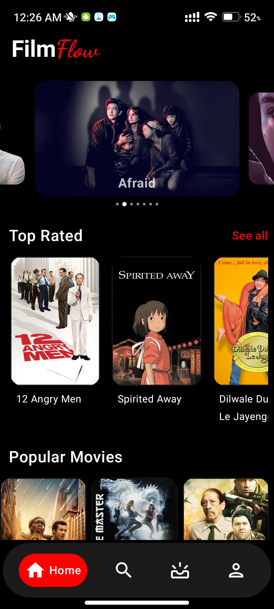
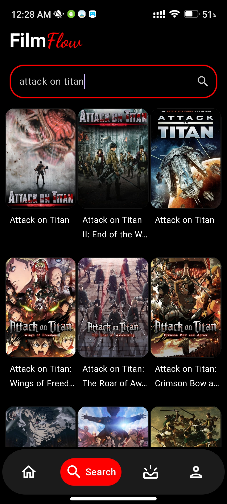
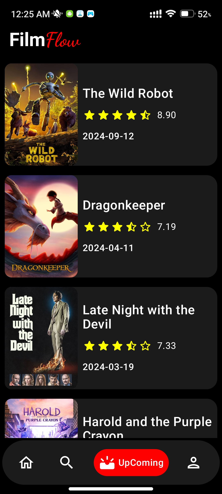
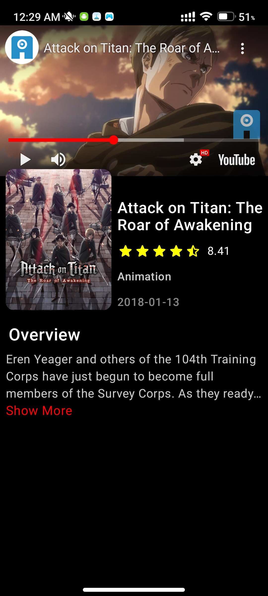

# 🎬 Movie App

Welcome to the **Movie App**! This mobile application allows users to discover, search, and view details about movies with a modern and intuitive interface. Built using **Jetpack Compose** for the UI, it integrates the latest Android development technologies for a smooth and responsive user experience.

## 🚀 Features

- **Search Movies**: Easily search for your favorite movies.
- **Popular Movies**: Browse a list of popular movies fetched from the movie API.
- **Movie Details**: View detailed information about each movie, including rating, release date, and description.
- **Dynamic UI**: Responsive and smooth UI designed with Jetpack Compose.

## 🛠️ Technologies Used

- **Kotlin**: Primary programming language.
- **Jetpack Compose**: For building a declarative and modern UI.
- **Retrofit**: For making network requests to the movie API.
- **Coil**: For efficient image loading and caching.
- **Dagger-Hilt**: For Dependency Injection to manage app components.
- **Coroutines & Flow**: For handling asynchronous tasks and data streams.
  
## 📚 Libraries

- [**Retrofit**](https://square.github.io/retrofit/): For making HTTP requests.
- [**Coil**](https://coil-kt.github.io/coil/): For loading and displaying images.
- [**Dagger Hilt**](https://dagger.dev/hilt/): For dependency injection.
- [**Kotlin Coroutines**](https://kotlinlang.org/docs/coroutines-overview.html): For managing background tasks.
- [**Flow**](https://developer.android.com/kotlin/flow): For reactive data streams.

&nbsp;&nbsp;&nbsp;&nbsp;  
&nbsp;&nbsp;&nbsp;&nbsp;

